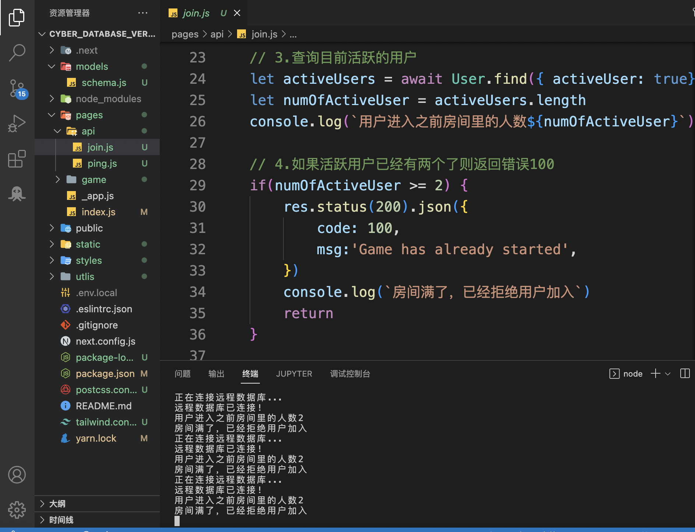
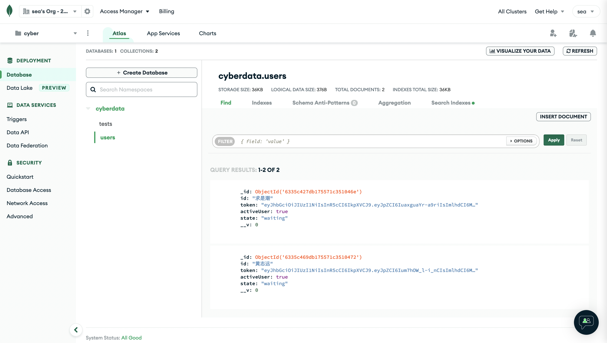
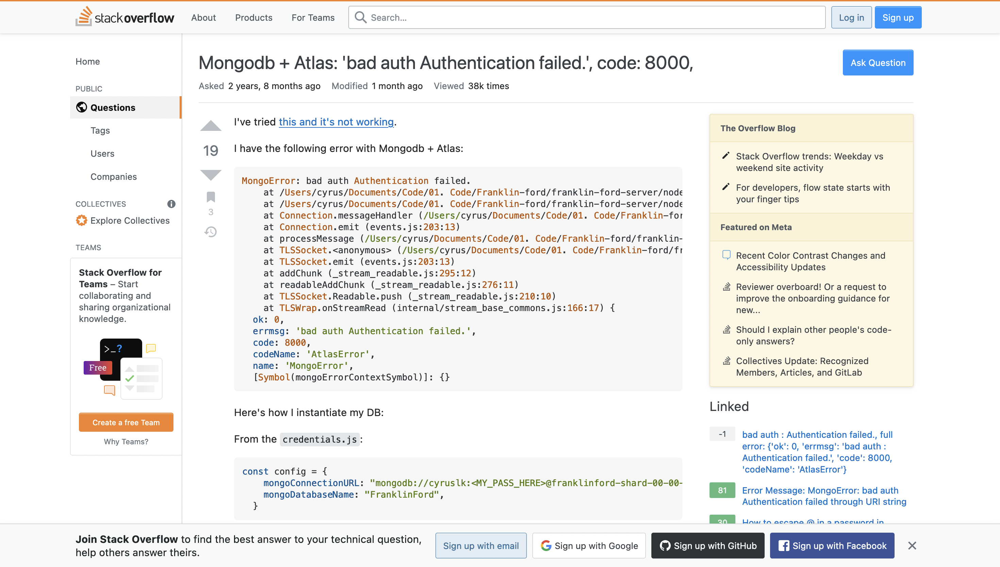
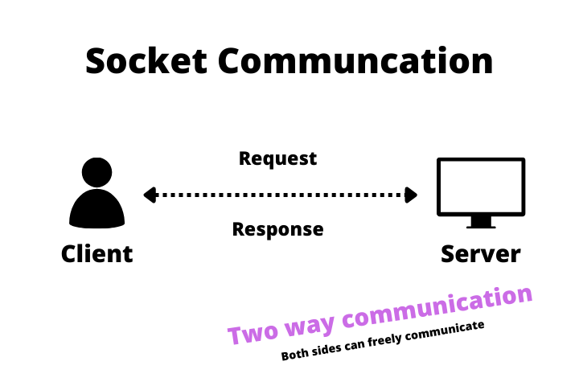

# HZY CyberPrison
## 启动方式
```
npm run dev 或
yarn dev
```
## 文件夹说明
server 在 `./pages/api`目录下 
client 入口在`./pages/index.js`
感觉Next.js同时写前后端的好处就是前后端域名相同，不用处理跨域
## 技术栈
~~Google + Youtube +Documentation +  StackOverflow~~
### socket version
Next.js / socket.io / （以及一些不重要的前端的库）
### database version
Next.js / axios / jwt / MongoDB / mongoose /   （以及一些不重要的前端的库）
## 使用说明
### socket_version
两个client输入相同房间号可进入同一个房间




### database_version

服务器默认 部署在localhost:3000/api

使用正确的格式返回了数据
 
如果房间满了会返回错误





如果只有一个人进入



数据库




## 写这道题的经历
这是个曲折的故事，所以有点点长bhys QAQ
### 为什么是JS写的? 
但我是个前端选手，呜呜呜完全不会Go lang，也不会Java（dbq PTA xgg）……好吧其实也不会Node.js，Next.js也不太会（之前只是在油管看过一点别人写next）……不过起码Next和Node都还是JS，补补天估计来得及。
### 为什么写了两题？
做完前端RandomCredit之后，看了看时间……啊我居然还有四天（可能因为确实Credit那题代码量不多），开始脑补：qsc要求我多展示学习能力，如果我闲了四天，会不会被认为没有跳出舒适圈，会不会觉得我态度不积极，会不会又收到感谢信…呜呜不要
### 写题的经过，为什么有两个版本？
所以我好像还得继续学点什么。Credit那题token xjj用node.js的express库写了一个server，确实我知道node.js能写server，那我也学下express好了？ 好像后端第二题是写API的，和后端于是我打开youtube，学习了express的创建服务端。正准备开始写的时候发现next.js好像也可以写后端？然后看文档终于知道/api那个文件夹是干啥的了，wow这也太方便了！

因为感觉这题和前端那题真的很互补，之前学axios的时候我也大概清楚了HTTP的method和status，所以直接把Credit的前端部分拿过来就行了，（也顺便学了一下postman和Rapid Client，所以其实不写前端也可以）模仿next.js的文档写好了/ping，实现了前后端的交互，本以为会一路顺风，然后第二个/join就开始爆肝了。大概理解了一下token是个啥，好像就是说server根据用户返回的一个值生成token，然后存入数据库同时把token发给，下次user就携带token访问server， server就认识用户了，简单来说就是authentication。

然后接下来一天上课的时间都在学习和配置数据库……太艰难了，一开始想用sqlite，捣鼓了一上午有一个Bug就是解不开（忘了是啥bug了），然后就果断换mongodb。非关系型数据库总归方便一点吧）然后配置mongodb也碰到一个一个小时没解开的bug，各种搜索心态块崩了，最后发现居然是`const uri = mongodb+srv://[username]:<password>@cluster0.yfafd.mongodb.net/myFirstDatabase?retryWrites=true&w=majority;`这段代码替换password要把<>删去……属实是讨厌这种小Bug。但顺利地实现了CRUD的那一刻真的超级开心，有种要从前端走向全栈的感觉，嘻嘻


然后往下我就碰到了一个想不明白的问题，clien2进入room之后，如何让server发送一个消息给client1, 这样client1就能从等待页面跳转到游戏界面……咦，等等，我的知识储备中server真的能主动给client发送消息吗？？后面两个客户端又是怎么通信的？？？

这时候就碰到了一个坎，不知道怎么办了。但我回忆起，好像realtime chat app在油管上不少Up都喜欢做，感觉这个对局游戏和real time app就很像，我发现很多chat app的视频都有提到一个技术叫socket.io，虽然不知道它是什么，但我隐约感觉似乎是solution。然后就结合YouTube, socket.io的文档学它，贴一篇感觉讲的最好的blog [Build a Real-time Chat Application Using Socket.io and NextJS](https://betterprogramming.pub/socket-io-and-nextjs-build-real-time-chat-application-part-1-976555ecba)
它让我明白了单向的C/S通信和双向的socket通信的区别


然后我感觉之前token mongo的版本我暂时真不知道怎么继续写了，但是socket.io真的非常非常适合创建需要client间通信的app，比如多人对局游戏、即时聊天app。到这时，已经几乎没时间了，所以我决定freestyle一下，就没照着pta xgg说的req res这些继续写了。就是想赶快试下socket.io看能不能在ddl之前尽可能多地实现需求。

一开始感觉理解socket.io的逻辑有点绕……直到我碰到一个搞了三个小时试了好几种方法还是没搞出来的bug，
```javascript
socket.on("newPlayerComeIn", (player) => {
      console.log(player)
      if(player.length == 1 && player[0] == id) {
        setEnemy('wait')
      } else if(player.length === 2) {
        player.map(pl => {
          if(pl != id) {
            setEnemy(pl)
          }
        })
      }
    }
```
真的不知道为啥这段就是不对，就导致了虽然我实现了client间能够通讯了, 但是提示对手的名字就是一直不对，然后就真的没时间了

但是虽然这个Bug我仍然不知道为什么有问题，但是捣鼓了三个小时之后我发现自己对于socket.io的熟悉程度大幅提升，一开始觉得很绕的逻辑也不绕了

所以说我把我写的两个版本都提交上去，虽然后续处理用户选择坦白/不坦白的逻辑没来得及写，但是这题狂肝了四天真的push我疯狂输入知识，我仍然收获颇丰hhhh
## 回答问题
### 有意思吗
~~还是前端更有意思~~
有意思！从前端走向后端的尝试是一个在狂肝中突破自我，在压力中痛并快乐的过程，同时也让我对于前后端API交互第一次有了直观的、实践的理解
### 学习资料
Youtube续命选手。我学习一项新技术的pattern是，结合官方文档学理论，同时看youtuber如何实践，然后google 我碰到的bug，stackoverflow寻找答案。因为感觉只看文档的话，还是不能完全清楚别人是怎么运用的，看一些一个小时的视频能快速上手
btw英语真的很重要，Youtube比b站的学习资源感觉高质量很多
### 最大的困难
可能是计网知识的缺乏？因为面试时间紧，我目前对Token cookie websocket的理解只停留在能用相关库写需求，但是我感觉这一块我还得专门花时间再补一补
### 能看懂吗
感觉debug了很长时间的代码不容易忘，前端代码可读性也比较强，但是后端的逻辑部分感觉不写注释确实可能第二天再读就有点费劲了
### 其他想说的
如果不是qsc面试push，自学的话我大概率不会一周输入那么多东西，所以我真的好想加入qsc，这样我就能保持输入状态。不过这周也确实特别肝呜呜呜，真的很希望我的努力能被token xjj / PTA xgg认可！


